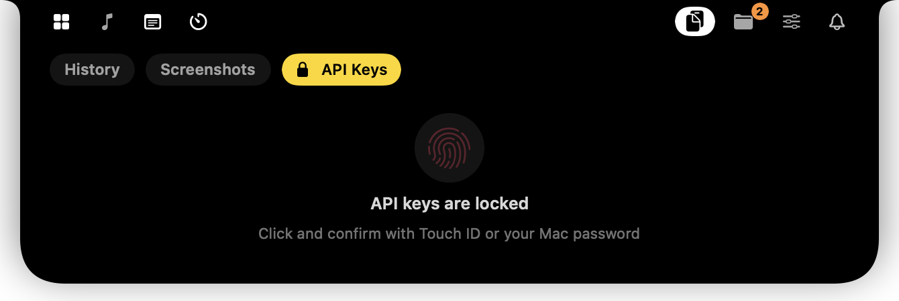

# Privacy in Notchly

Notchly lives in the most visible spot on your screen and touches personal things — notifications, clipboard, tasks, mail. It is built so that **none of it leaves your Mac** unless you explicitly turn on a service that needs the network.

## At a glance

| What | Where it lives | Who can see it |
|---|---|---|
| Tasks, notes, file shelf, alarms | `~/Library/Application Support/Notchly/*.json` — folder `700`, files `600` (owner only) | only you |
| Clipboard history | `~/Library/Application Support/Notchly/clipboard.json` (`600`), auto-expires | only you |
| Screenshots & copied images | `~/Library/Application Support/Notchly/Screenshots/` — folder `700`, files `600`; kept 1–7 days (3 by default), at most 40 | only you |
| Headphone connection log | `~/Library/Application Support/Notchly/airpods-log.txt` (`600`, capped at ~200 KB): connect times, charge levels, names of system windows over the notch — for debugging, never sent anywhere | only you |
| Settings | `UserDefaults` (`dev.notchly.app`) — tab layout and on/off switches, no personal data | only you |
| Gmail app password, Gemini API key | macOS Keychain, *this device only* (never synced to iCloud), readable only while the Mac is unlocked | only Notchly, after macOS asks you |
| API key vault | macOS Keychain, unlocked with Touch ID / Mac password, auto-locks after 2 minutes | only you |
| App notifications | read-only from macOS Notification Center database | never copied or sent anywhere |
| Calendar events | EventKit, in memory only | never stored or sent |

There is **no server, no analytics, no telemetry, no crash reporting.**

## Secrets never touch the disk in plain text

- The API key vault is locked by default. Opening it requires Touch ID or the Mac password (`LocalAuthentication`), and it locks itself again after two minutes or whenever the island closes.
- Keys are stored as a single Keychain item, never in `UserDefaults` or files.
- At launch Notchly only checks *whether* a key exists (Keychain attributes, no secret), so macOS never pops a Keychain prompt out of nowhere.

## Clipboard history you control

- Entries marked as concealed or transient by password managers (`org.nspasteboard.ConcealedType`, 1Password, etc.) are **never recorded**.
- History expires automatically; the retention period is set in *Settings → Clipboard*. *Clear* asks once more before wiping everything, so a stray click can't erase it.
- Each entry can be deleted individually, and text history can be switched off completely.

### Screenshots

- Screenshots taken to the clipboard (⌃⇧⌘4) and copied images are kept in a separate *Screenshots* section — as owner-only files, for a few days (1, 2, 3 or 7; 3 by default), and never more than 40 of them. Old ones are deleted automatically.
- Screenshots saved to the Desktop are picked up **only if you turn it on**. Notchly then finds new screen captures with a local Spotlight query (`kMDItemIsScreenCapture`) — it does not scan your folders — and copies them; the originals stay where they are. macOS asks for Desktop access the first time.
- Images are never uploaded anywhere. Pasteboard items marked concealed by password managers are skipped here too.

## Notifications: read-only, and quiet while you focus

- Notchly reads the Notification Center database **read-only** (this is why it asks for Full Disk Access). It never modifies the database; “deleting” a notification only hides it inside Notchly.
- During a Pomodoro focus session, notification cards are held back. At the end you see a single count instead of a stream of distractions — the contents are never shown on screen while you work.

## Links are opened safely

Links from task descriptions, calendar events and reminder cards are opened only if they are `http` / `https`. Anything else a text or an invite could contain — `file://`, custom app schemes — is ignored.

## Network access — only what you turn on

| Feature | Connects to | When |
|---|---|---|
| Weather | `api.open-meteo.com` (latitude/longitude only, no account) | at most every 10 min |
| Approximate location | `ipapi.co` | until you allow precise location (tap the weather card) |
| Gmail | `imap.gmail.com:993` over TLS, with an app password | only if you connect Gmail |
| Gemini | `generativelanguage.googleapis.com` | only when you send a prompt |
| Album art, app icons | `itunes.apple.com` search / lookup (track title + artist, or an app’s bundle ID) | only when the player’s artwork is too small or an icon is missing |

Nothing else goes over the network.

## Permissions and why they are needed

| Permission | Used for | Without it |
|---|---|---|
| Accessibility | intercepting volume/brightness keys, keeping the menu bar from sliding over the island | system HUD is shown instead |
| Full Disk Access | reading app notifications | only Gmail notifications |
| Audio Capture | per-app volume mixer (Core Audio process taps; audio is only scaled, never recorded) | mixer is hidden |
| Calendars | reminders before meetings | only task reminders |
| Bluetooth | headphone battery | no headphone card |
| Location | local weather | approximate location by IP (`ipapi.co`) |
| Desktop folder | copying screenshots saved to the Desktop — only if you enable it | only clipboard screenshots |

Every permission is optional; Notchly degrades gracefully.

**Asked only when needed.** At first launch macOS asks only for Bluetooth (headphone connections). Accessibility is requested once — never again on later launches. Calendar access is asked the first time you open *Tasks*, precise location only when you tap the weather card, audio capture only once a per-app volume is actually changed (or a saved one is restored), Desktop access only after you turn on Desktop screenshots.

Every feature that shows something on the island — HUDs, charging and headphone cards, app and Gmail notifications, reminders, the chime — can be switched off in *Settings*.

## Deleting your data

1. Quit Notchly (menu-bar icon → *Quit*, or *Settings → About Notchly → Quit*).
2. Delete `~/Library/Application Support/Notchly/`.
3. In *Keychain Access*, search for `dev.notchly.app` and delete the items.
4. Optionally reset preferences and settings: `defaults delete dev.notchly.app`.
