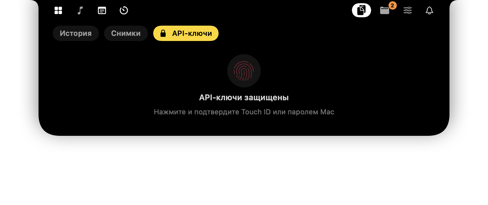
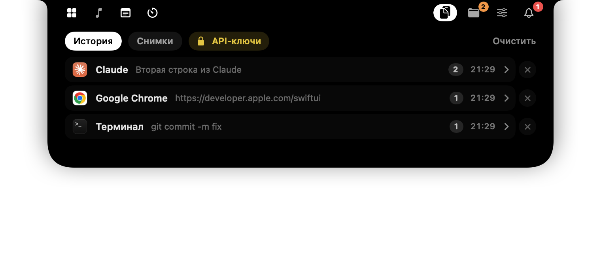
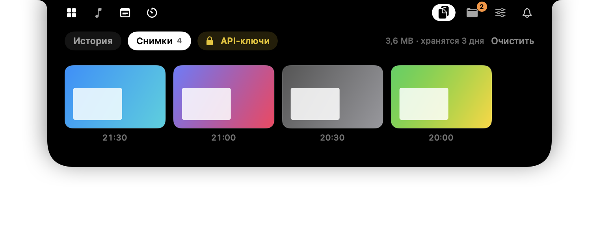
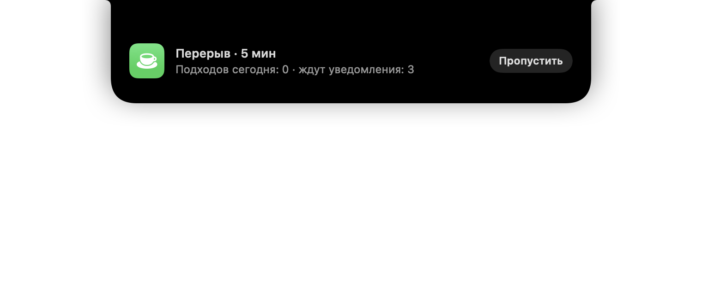

# Приватность в Notchly

[English](PRIVACY.md) · **Русский**

Notchly живёт в самом заметном месте экрана и касается личного — уведомлений, буфера обмена, задач, почты. Он устроен так, что **ничего из этого не покидает ваш Mac**, если вы сами не включите сервис, которому нужна сеть.

## Коротко

| Что | Где хранится | Кто видит |
|---|---|---|
| Задачи, заметки, полка файлов, будильники | `~/Library/Application Support/Notchly/*.json` — папка `700`, файлы `600` (только владелец) | только вы |
| История буфера обмена | `~/Library/Application Support/Notchly/clipboard.json` (`600`), удаляется сама по сроку | только вы |
| Снимки экрана и скопированные картинки | `~/Library/Application Support/Notchly/Screenshots/` — папка `700`, файлы `600`; хранятся 1–7 дней (по умолчанию 3), не больше 40 | только вы |
| Настройки | `UserDefaults` (`dev.notchly.app`) — раскладка вкладок и переключатели, без личных данных | только вы |
| Пароль приложения Gmail, API-ключ Gemini | Связка ключей macOS, *только на этом устройстве* (не синхронизируется с iCloud), доступна только при разблокированном Mac. Пока Notchly работает, пароль Gmail держится ещё и в памяти (никогда на диске), чтобы не расшифровывать его из Связки ключей каждые 30 секунд | только Notchly, после вопроса macOS |
| Хранилище API-ключей | Связка ключей macOS, открывается Touch ID / паролем Mac, само закрывается через 2 минуты | только вы |
| Уведомления приложений | только чтение из базы Центра уведомлений macOS | никуда не копируются и не отправляются |
| События календаря | EventKit, только в памяти | не сохраняются и не отправляются |

**Нет ни сервера, ни аналитики, ни телеметрии, ни отчётов о сбоях.**

## Секреты никогда не лежат на диске открытым текстом

- Хранилище API-ключей по умолчанию закрыто. Чтобы открыть его, нужен Touch ID или пароль Mac (`LocalAuthentication`); через две минуты или при закрытии острова оно запирается снова.
- Ключи хранятся одной записью в Связке ключей — никогда в `UserDefaults` или файлах.
- При запуске Notchly проверяет лишь, *есть ли* ключ (атрибуты записи, без секрета), поэтому macOS не показывает внезапных запросов Связки ключей.

## История буфера обмена под вашим контролем

- Записи, которые менеджеры паролей помечают как скрытые или временные (`org.nspasteboard.ConcealedType`, 1Password и т. п.), **никогда не сохраняются**.
- История удаляется сама; срок хранения задаётся в *Настройки → Буфер обмена*. «Очистить» переспрашивает перед удалением всего, чтобы случайный клик ничего не стёр.
- Каждую запись можно удалить отдельно, а историю текста — выключить совсем.

### Снимки экрана

- Снимки в буфер обмена (⌃⇧⌘4) и скопированные картинки лежат в отдельном разделе *Снимки* — файлами, доступными только владельцу, несколько дней (1, 2, 3 или 7; по умолчанию 3) и не больше 40 штук. Старые удаляются сами.
- Снимки, сохранённые на рабочий стол, подхватываются **только если это включить**. Тогда Notchly находит новые снимки локальным запросом Spotlight (`kMDItemIsScreenCapture`) — папки он не сканирует — и копирует их; оригиналы остаются на месте. macOS один раз спросит доступ к рабочему столу.
- Картинки никуда не загружаются. Элементы буфера, помеченные менеджерами паролей как скрытые, пропускаются и здесь.

## Уведомления: только чтение и тишина во время фокуса

- Notchly читает базу Центра уведомлений **только на чтение** (поэтому и нужен полный доступ к диску). Он никогда не меняет базу; «удаление» уведомления лишь скрывает его внутри Notchly.
- Во время «Помидора» карточки уведомлений придерживаются. В конце вы видите одно число вместо потока отвлечений — содержимое не появляется на экране, пока вы работаете.

## Ссылки открываются безопасно

Ссылки из описаний задач, событий календаря и карточек напоминаний открываются, только если это `http` / `https`. Всё остальное, что может оказаться в тексте или приглашении, — `file://`, собственные схемы приложений — игнорируется.

## Сеть — только то, что вы включили

| Функция | Куда подключается | Когда |
|---|---|---|
| Погода | `api.open-meteo.com` (только широта и долгота, без аккаунта) | не чаще раза в 10 минут |
| Примерное местоположение | `ipapi.co` | пока вы не разрешите точную геопозицию (нажатие на карточку погоды) |
| Gmail | `imap.gmail.com:993` по TLS, с паролем приложения; одно соединение остаётся открытым и проверяется каждые 30 с (только чтение, `EXAMINE`) | только если подключить Gmail |
| Gemini | `generativelanguage.googleapis.com` — ваш запрос, а также текст и время невыполненных задач, чтобы помощник не дублировал их | только когда вы отправляете запрос |
| Обложки альбомов, иконки приложений | поиск / lookup `itunes.apple.com` (название трека и исполнитель или bundle ID приложения) | только если обложка из плеера слишком мелкая или иконки нет |

Больше ничего по сети не уходит.

## Доступы и зачем они нужны

| Доступ | Зачем | Без него |
|---|---|---|
| Универсальный доступ | перехват клавиш громкости и яркости, чтобы строка меню не наезжала на остров | показывается системный индикатор |
| Полный доступ к диску | чтение уведомлений приложений | только уведомления Gmail |
| Запись аудио | микшер громкости по приложениям (Core Audio process taps; звук только масштабируется, не записывается) | микшер скрыт |
| Календари | напоминания перед встречами | только напоминания о задачах |
| Bluetooth | заряд наушников | нет карточки наушников |
| Геопозиция | местная погода | примерное местоположение по IP (`ipapi.co`) |
| Папка «Рабочий стол» | копирование снимков, сохранённых на рабочий стол, — только если включить | только снимки из буфера обмена |

Каждый доступ необязателен; без него Notchly аккуратно отключает соответствующую функцию.

**Спрашиваем только когда нужно.** При первом запуске macOS спрашивает только Bluetooth (подключения наушников). Универсальный доступ запрашивается один раз — при следующих запусках больше никогда. Доступ к календарю спрашивается при первом открытии *Задач*, точная геопозиция — только при нажатии на карточку погоды, запись аудио — только когда громкость приложения действительно меняется (или восстанавливается сохранённая), рабочий стол — только после включения снимков с рабочего стола.

Всё, что появляется на острове, — индикаторы, карточки зарядки и наушников, уведомления приложений и Gmail, напоминания, сигнал — можно выключить в *Настройках*.

## Как удалить свои данные

1. Закройте Notchly (значок в строке меню → *Выйти* или *Настройки → О Notchly → Выйти*).
2. Удалите `~/Library/Application Support/Notchly/`.
3. В *Связке ключей* найдите `dev.notchly.app` и удалите записи.
4. При желании сбросьте настройки: `defaults delete dev.notchly.app`.
