<p align="center">
  
</p>

<h1 align="center">Notchly</h1>

<p align="center">
  <b>English</b> · <a href="README.ru.md">Русский</a>
</p>

<p align="center">
  Turns the MacBook notch into an interactive island — music, tasks, notes, timers, reminders,<br>
  clipboard, files and system controls, one hover away. Native SwiftUI, no Electron, no Xcode required.
</p>

<p align="center">
  
</p>

<p align="center">
  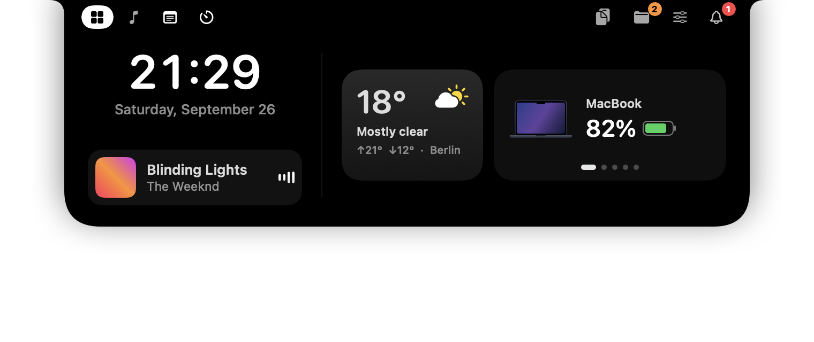
</p>

## Contents

- [Download](#download)
- [How it works](#how-it-works)
- [Features](#features) — [Home](#home) · [Music](#music) · [Notes & Tasks](#notes--tasks) · [Timer](#timer-pomodoro-and-alarms) · [Reminders](#reminders) · [AirPods & batteries](#airpods-and-batteries) · [Controls](#controls) · [Files](#files) · [Clipboard](#clipboard) · [Notifications](#notifications) · [Collapsed island](#the-collapsed-island) · [Settings](#settings)
- [Privacy](#privacy)
- [Requirements](#requirements) · [Build & run](#build--run) · [Permissions](#permissions)
- [Engineering highlights](#engineering-highlights) · [Self-checks](#self-checks) · [Project structure](#project-structure)

## Download

Grab `Notchly-1.0.dmg` from [Releases](../../releases), open it and drag Notchly to Applications.

The app is signed with a local certificate, not an Apple Developer ID, so on first launch macOS says it can’t verify the developer. Right-click Notchly → **Open** → **Open** (or *System Settings → Privacy & Security → Open Anyway*). You only need to do this once.

## How it works

- **Hover** over the notch — the island drops down like a curtain and shows the last tab (or Home). Move the pointer away and it closes after a delay you choose; a click outside closes it at once.
- **Tabs** sit on both sides of the notch: Home, Music, Notes & Tasks and Timer on the left; Clipboard, Files, Controls and the notification bell on the right. Their order, side and visibility are configurable.
- **Collapsed**, the island stays alive: it shows what’s playing, running timers, the volume/brightness HUD, charging and headphone cards, reminders and notifications — then tucks back into the notch.
- On Macs **without a notch** the island becomes a floating pill at the top of the screen.
- The whole interface is available in **English and Russian** and switches live, without a restart.

## Features

### Home

The clock and date, a mini player, the weather and a swipeable battery card — MacBook, AirPods (left / right / case), AirPods Max, Magic Mouse, iPhone and other Bluetooth accessories. When nothing is playing, the player turns into a summary of the day: “4 tasks · 22:00 Team call”.

Weather comes from Open-Meteo: the current temperature, conditions, today’s high and low and the city. Click the card to allow precise location or to open the full forecast.

<p align="center">
  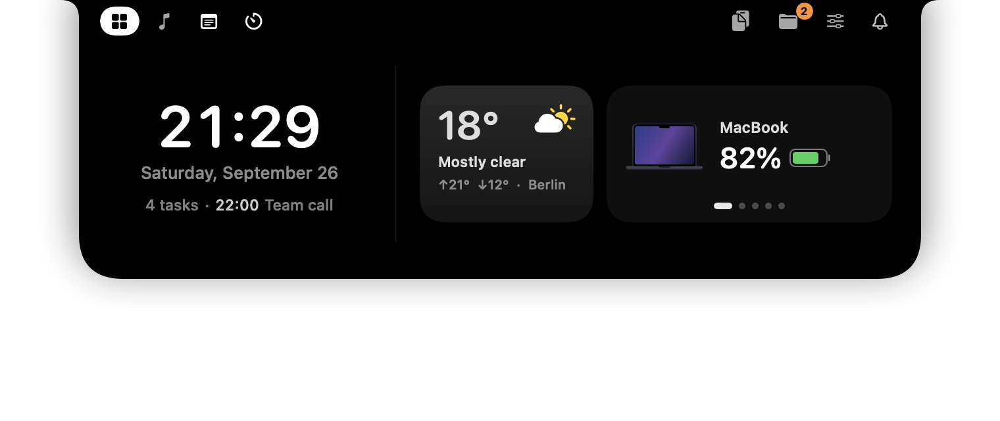
  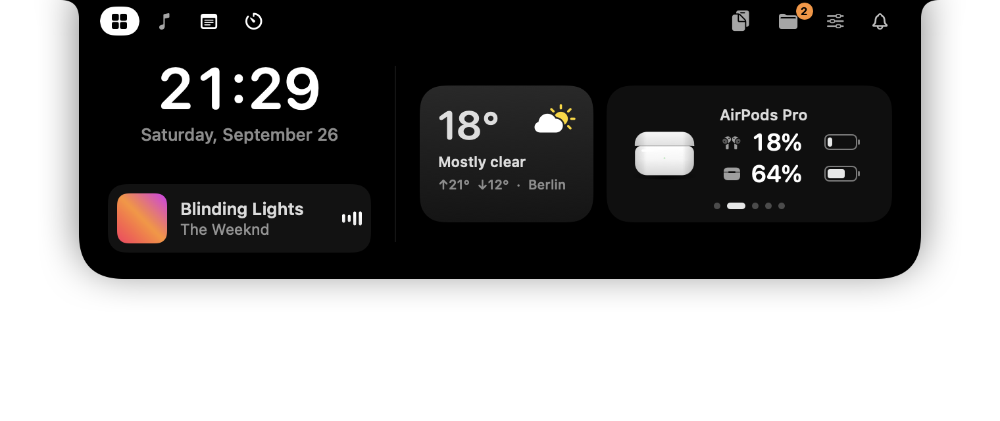
</p>

### Music

Large artwork with a glow sampled from the cover, the track and artist, a scrubbable progress bar, previous / play-pause / next and repeat-one. Quick switch between **Apple Music, Spotify and YouTube Music** (in the browser); if nothing is playing, one click starts any of them. Works with any app that reports Now Playing to macOS — including macOS 15.4+, where the system API is closed to third-party apps (see [Engineering highlights](#engineering-highlights)).

<p align="center">
  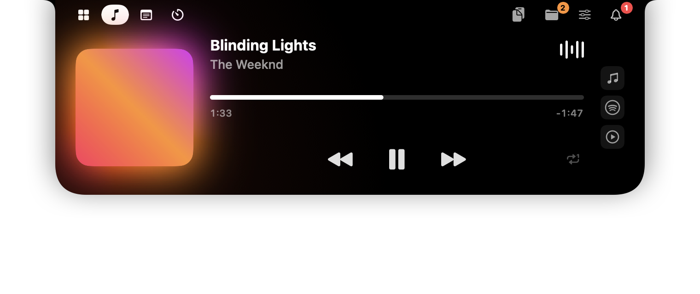
  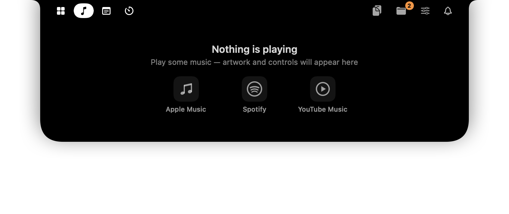
</p>

### Notes & Tasks

**Notes** — a list of notes with a rich-text editor: bold, italic, strikethrough, text size. Notes are saved as you type.

**Tasks** — a one-week planner (Today, Tomorrow, then days of the week) with swipes between days. Each task can have a time and a description; links in descriptions become buttons. Unfinished tasks from past days move to Today by themselves. Any task can start a Pomodoro session bound to it.

**Gemini assistant** — type your plans in plain language (“gym at 5, call at 10”) and it turns them into short tasks with times; a question gets a short answer instead. It replies in the interface language and needs your own free Gemini API key, stored in the Keychain.

<p align="center">
  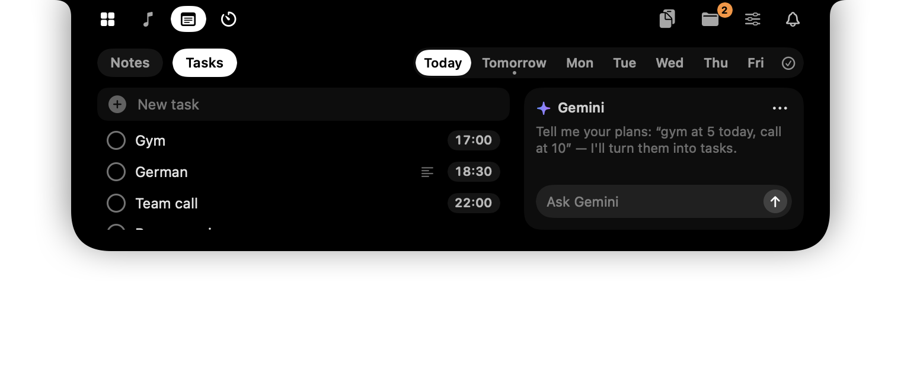
  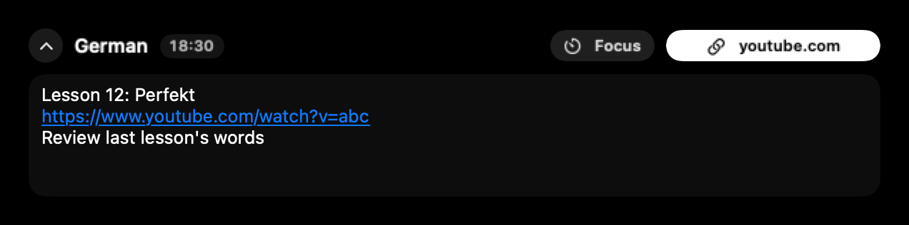
</p>

### Timer, Pomodoro and alarms

- **Pomodoro** — 25 minutes of work, a 5-minute break, a 15-minute break after every fourth round; the dots show progress, rounds are counted per day. Optionally bound to a task. While you focus, notifications wait quietly and you get one summary at the break.
- **Timer** — presets (1, 5, 10, 15, 30, 60 min) or any time down to the second: arrows or just type the numbers. When it rings: *Again* or *Done*.
- **Alarms** — a list of alarms with on/off switches; when one rings you can *Stop* it or snooze for *+5 min*.
- A running timer lives in the **collapsed island** as a progress ring and a countdown.

<p align="center">
  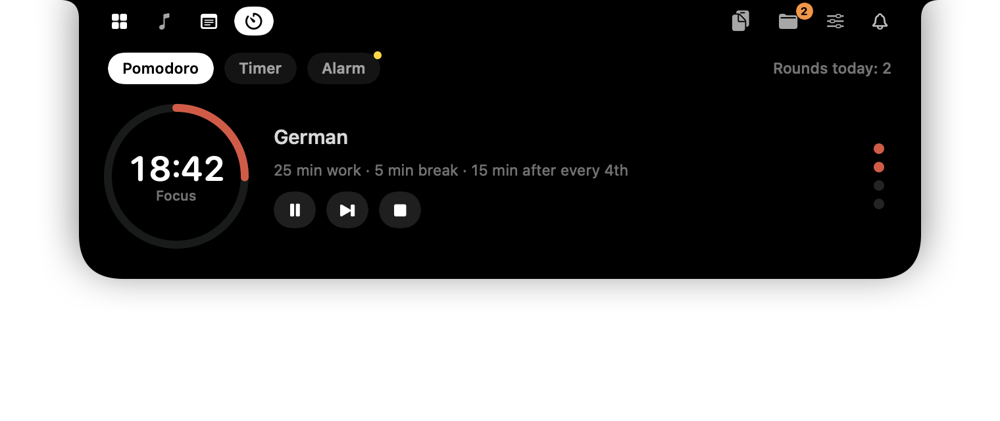
  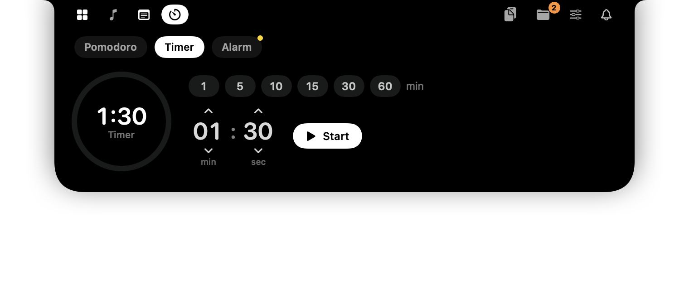
</p>
<p align="center">
  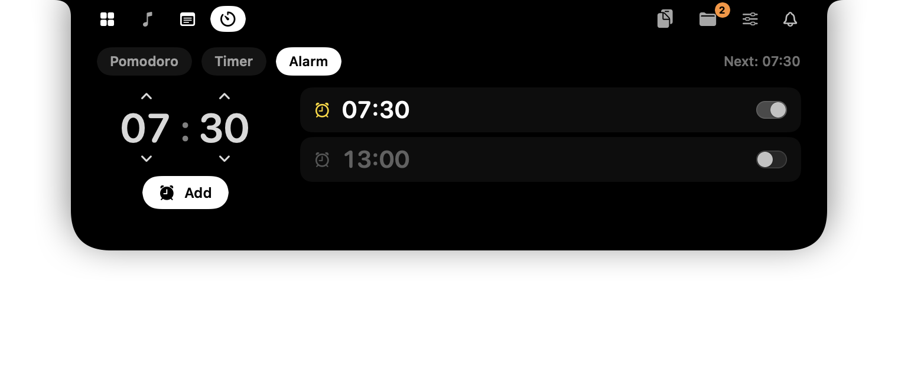
  
</p>

### Reminders

10 and 5 minutes before, and exactly at the start of, a timed task or a calendar event, a card drops out of the notch with a soft synthesized chime:

- **Join** opens Zoom, Google Meet, Microsoft Teams, FaceTime or Yandex Telemost links found in the event;
- **+5 min** snoozes the reminder;
- **Done** checks the task off.

Reminders are not repeated and don’t pop up all at once after the Mac wakes from a long sleep. A task right after midnight still gets its reminders the evening before.

<p align="center">
  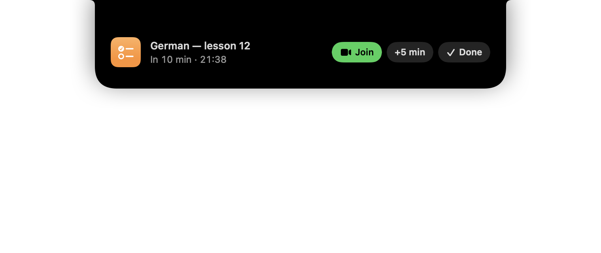
  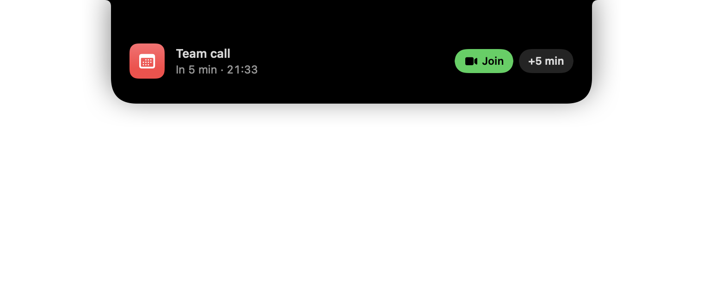
</p>

### AirPods and batteries

When headphones connect, the island shows the earbuds and the case with charge rings, like on iPhone; click it for the full sheet. AirPods Pro, AirPods, AirPods Max and Beats are supported; every connected pair gets its own card on Home. Plugging in the charger shows a charging card with the MacBook’s level.

<p align="center">
  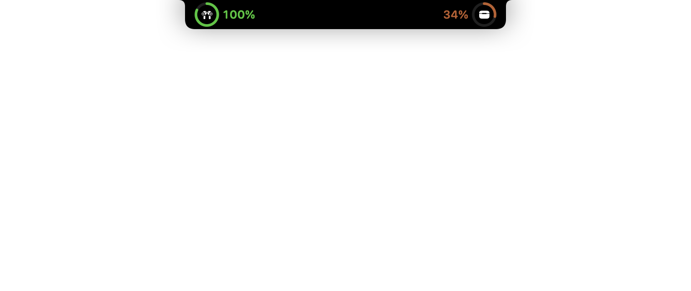
  
</p>
<p align="center">
  
  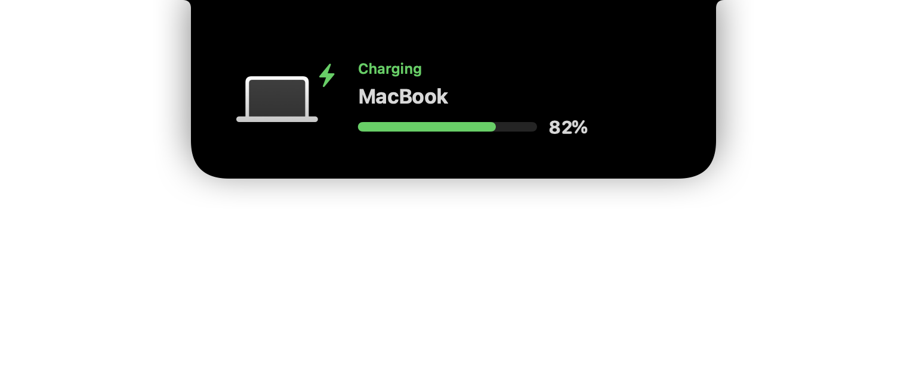
</p>

### Controls

Volume and brightness sliders and a **per-app volume mixer**: every app that is playing sound gets its own slider from 0 to 100 %, built on Core Audio process taps. Volume and brightness keys show Notchly’s own HUD in the notch instead of the system one.

<p align="center">
  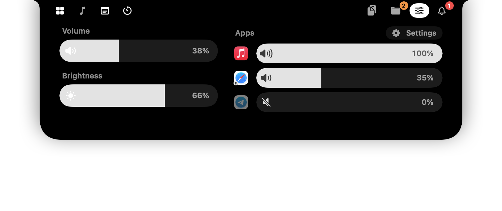
  
</p>

### Files

A shelf for files: drop files onto the notch to keep them at hand and drag them out into any app. Double-click opens a file; the context menu offers Open, Reveal in Finder, AirDrop, Copy Path and Remove.

<p align="center">
  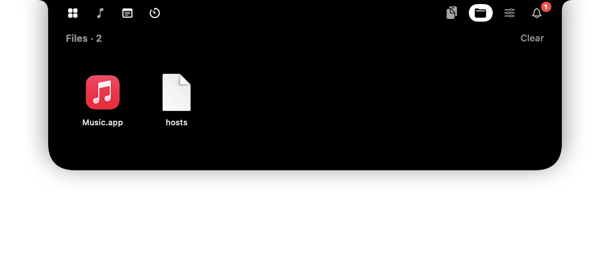
</p>

### Clipboard

- **History** — copied text grouped by app, with times; click to copy again, give entries their own names, delete them one by one or clear everything. Password-manager entries are never recorded.
- **Screenshots** — screenshots to the clipboard (⌃⇧⌘4) and copied images are kept for a few days: click to copy, drag into any app, save a copy, rename. Optionally Desktop screenshots too.
- **API keys** — a vault for keys and tokens, locked behind Touch ID or the Mac password and stored in the Keychain.

<p align="center">
  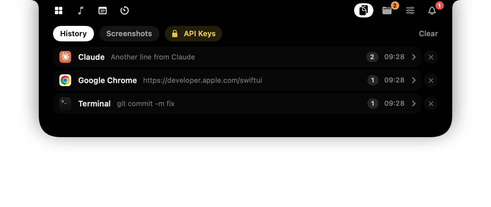
  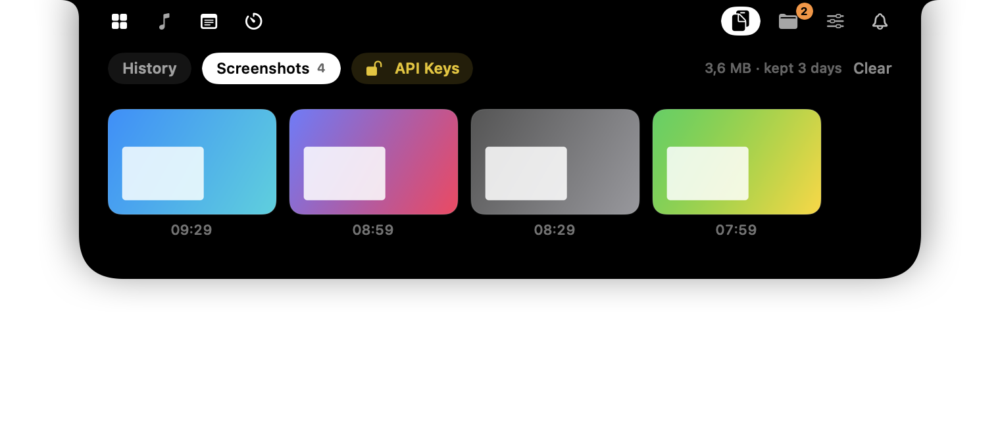
</p>
<p align="center">
  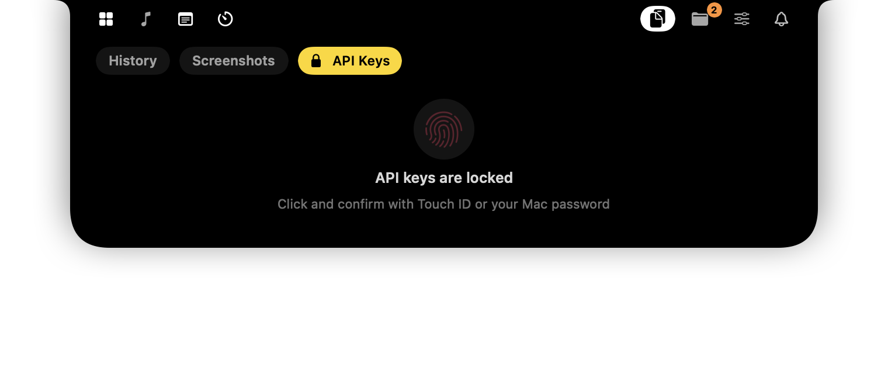
</p>

### Notifications

The bell collects **app notifications** (Telegram, WhatsApp, Messages and others — read-only from macOS Notification Center) and **new Gmail messages** (IMAP with an app password). New ones pop out of the notch as cards; click one to open the app or the letter.

<p align="center">
  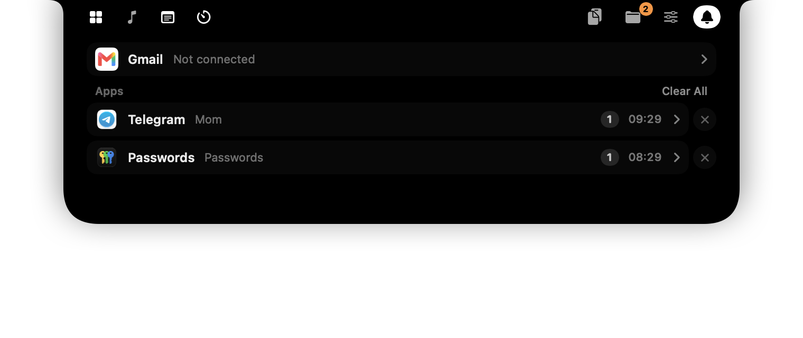
  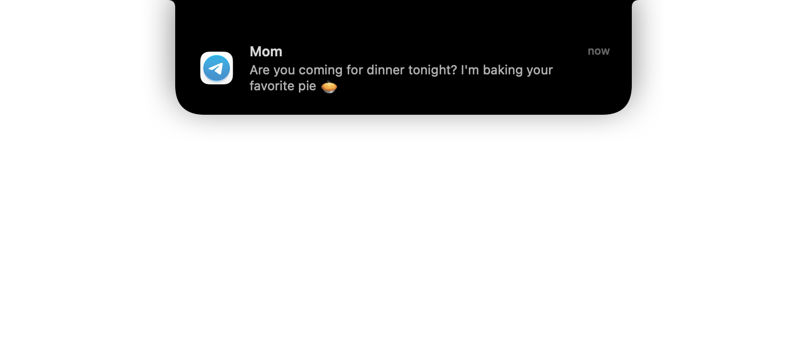
</p>

### The collapsed island

Even when closed, the island shows what matters beside the notch: the artwork and an equalizer while music plays, the new track’s title, the volume/brightness HUD, “Copied”, timer and Pomodoro rings, the headphone battery — and event cards for reminders, alarms, the end of a timer or a focus session.

<p align="center">
  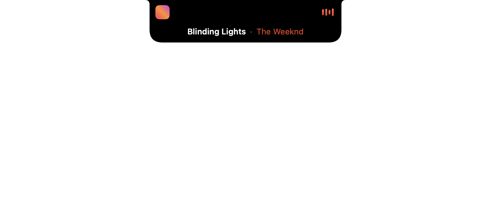
  
</p>
<p align="center">
  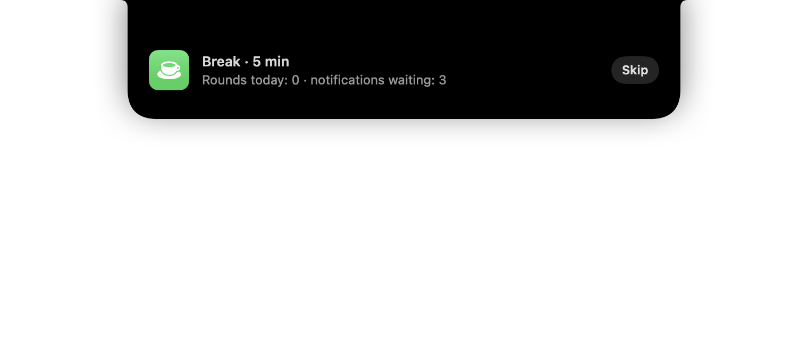
  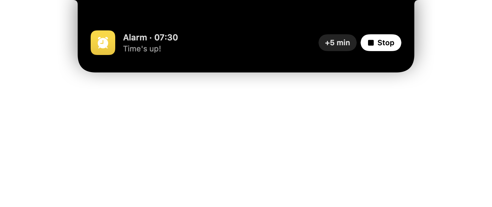
</p>

### Settings

A separate window that opens right under the island, so every change is visible live:

- **General** — language (English / Russian), open at login, menu bar icon, which tab the island opens on, how long it stays open after the pointer leaves;
- **Tabs** — order, side of the notch (left / right) and visibility of every tab;
- **Island** — music activity, track title peek, HUD instead of the system one, “Copied”, charging and headphone cards;
- **Notifications** — app notifications, Gmail, task and meeting reminders, the soft chime;
- **Clipboard** — text history and how long to keep it, screenshots, Desktop screenshots, used space;
- **About Notchly** — version and Quit.

<p align="center">
  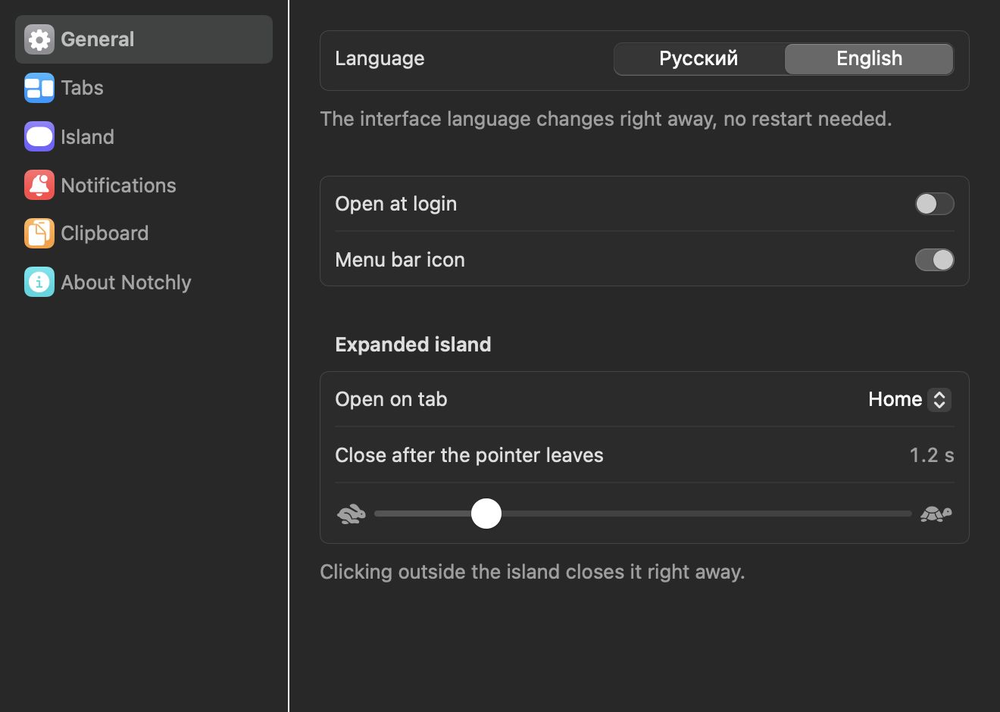
  
</p>

## Privacy

Everything stays on your Mac: no server, no analytics, no telemetry. Secrets live only in the Keychain (this device only), the API vault is behind Touch ID, data files are owner-only, the clipboard skips password-manager entries, notifications are read read-only, only web links are ever opened, and permissions are asked only when a feature needs them. Details and a full list of network calls: **[PRIVACY.md](PRIVACY.md)**.

## Requirements

- A MacBook with a notch (other Macs get a floating pill), **macOS 14 Sonoma or later**; developed on Apple Silicon, builds as a universal app.
- For building: Command Line Tools (`xcode-select --install`). Xcode is not needed.

## Build & run

```bash
git clone https://github.com/oleksandrsenko/Notchly.git && cd Notchly
./scripts/setup-signing.sh   # once: a local signing certificate, so permissions survive rebuilds
./build.sh                   # universal build/Notchly.app
open build/Notchly.app
```

| Script | What it does |
|---|---|
| `./build.sh` | builds the universal `build/Notchly.app`, bundles the media adapter, signs it |
| `./scripts/make-dmg.sh` | builds `build/Notchly-<version>.dmg` for a release |
| `./scripts/update-screenshots.sh` | re-renders the README screenshots in both languages |
| `swift scripts/make-icon.swift` | regenerates the app icon |
| `python3 scripts/check-l10n.py` | checks that every UI string has an English translation |

### Permissions

Every permission is optional and asked only when the feature is first used; without it Notchly just hides that feature.

| Permission | Used for |
|---|---|
| Accessibility | volume/brightness key interception, keeping the menu bar from sliding over the island |
| Full Disk Access | reading app notifications |
| Audio Capture | the per-app volume mixer (audio is scaled, never recorded) |
| Calendars | meeting reminders |
| Bluetooth | headphone battery |
| Location | local weather (otherwise approximate, by IP) |
| Desktop folder | keeping Desktop screenshots (only if you turn it on) |

## Engineering highlights

- **Now Playing on macOS 15.4+.** `MediaRemote` is closed to third-party apps, so a tiny dylib (`MediaAdapter/`) is loaded into the system `/usr/bin/perl`, which is still entitled, and streams player state as JSON lines. AppleScript is the fallback.
- **Per-app volume.** Core Audio process taps + a private aggregate device. Taps are created only for apps below 100 % and the process list is updated in place, so audio never restarts. Helper processes are folded into their parent app via `responsibility_get_pid_responsible_for_pid`; Core Audio listeners replace polling.
- **Animations without layout jumps.** Island content lives on a fixed, centered canvas; only the black shape (background + mask) animates, so views never slide sideways and text is never scaled or blurred. Endless animations (equalizer, shimmer, pulse) run on Core Animation, so an idle island costs almost no CPU.
- **System integration.** `CGEventTap` intercepts brightness/volume keys and keeps the menu bar from sliding over the island; notifications are read read-only from the Notification Center database with `DispatchSource` file watching; IMAP runs on `Network.framework` with TLS over one long-lived connection; calendar via EventKit; AirPods battery via IOBluetooth.
- **No Xcode.** A Swift Package + Command Line Tools. `build.sh` builds a universal `.app`, bundles the media adapter and signs it with a stable local certificate so macOS permissions survive rebuilds.
- **Headless UI checks.** `Notchly --snapshots <dir>` renders every island state to PNG — every screenshot in this README is produced this way, in both languages.

### Self-checks

```bash
swift build
.build/debug/Notchly --snapshots /tmp/notchly --lang en   # render every state to PNG
.build/debug/Notchly --gif docs/notchly.gif --lang en      # the README animation, frame by frame
.build/debug/Notchly --reminders-selftest                  # reminder scheduling, incl. across midnight
.build/debug/Notchly --mixer-selftest                      # which apps are playing audio
.build/debug/Notchly --batteries-selftest                  # connected devices and their charge
.build/debug/Notchly --bench                               # CPU load of the island in typical states
.build/debug/Notchly --chime                               # play the reminder sound
python3 scripts/check-l10n.py                              # translations are complete
```

## Project structure

```
Sources/Notchly/
  App.swift                      entry point, menu bar icon, self-check flags
  IslandModel.swift              island state machine and animation timings
  NotchWindowController.swift    the panel over the notch, hover and clicks
  MediaController.swift          now playing (media adapter + AppleScript fallback)
  ScriptablePlayers.swift        Apple Music / Spotify control
  AppAudioMixer.swift            per-app volume on Core Audio process taps
  SystemControls.swift           volume, brightness, HUD
  MediaKeyInterceptor.swift      CGEventTap for media keys
  MenuBarGuard.swift             keeps the menu bar from covering the island
  Reminders.swift                reminders, calendar, soft chime
  Focus.swift, ClockTimers.swift Pomodoro, timer, alarms
  Stores.swift                   tasks, notes, file shelf; data migration
  ClipboardMonitor.swift         clipboard history
  ScreenshotStore.swift          screenshots and copied images
  KeyVault.swift, Keychain.swift Touch ID–protected API key vault
  DeviceBatteryMonitor.swift     MacBook, AirPods and accessory batteries
  WeatherService.swift           Open-Meteo weather and location
  GmailClient.swift              IMAP over Network.framework
  SystemNotifications.swift      Notification Center database reader
  GeminiAssistant.swift          plans → tasks via Gemini
  Settings.swift                 user settings
  Localization.swift, English.swift  L(...) lookup and the English table
  Snapshots.swift, ReadmeGIF.swift, Bench.swift  headless renders and benchmarks
  Views/                         SwiftUI views for every tab, card and the settings window
MediaAdapter/                    dylib loaded into /usr/bin/perl for Now Playing
Resources/                       Info.plist, icon, localized app name
scripts/                         signing, icon, .dmg, screenshots, translation check
docs/                            icon, animation and screenshots (en / ru)
```

## Roadmap

- Ask Gemini about selected text with a global shortcut
- Spaced-repetition cards generated from a PDF dropped on the island

## License

[MIT](LICENSE)

---

<sub>Notchly is not an Apple product. “Dynamic Island”, AirPods, Apple Music and FaceTime are trademarks of Apple Inc.; other product names belong to their owners.</sub>
