<p align="center">
  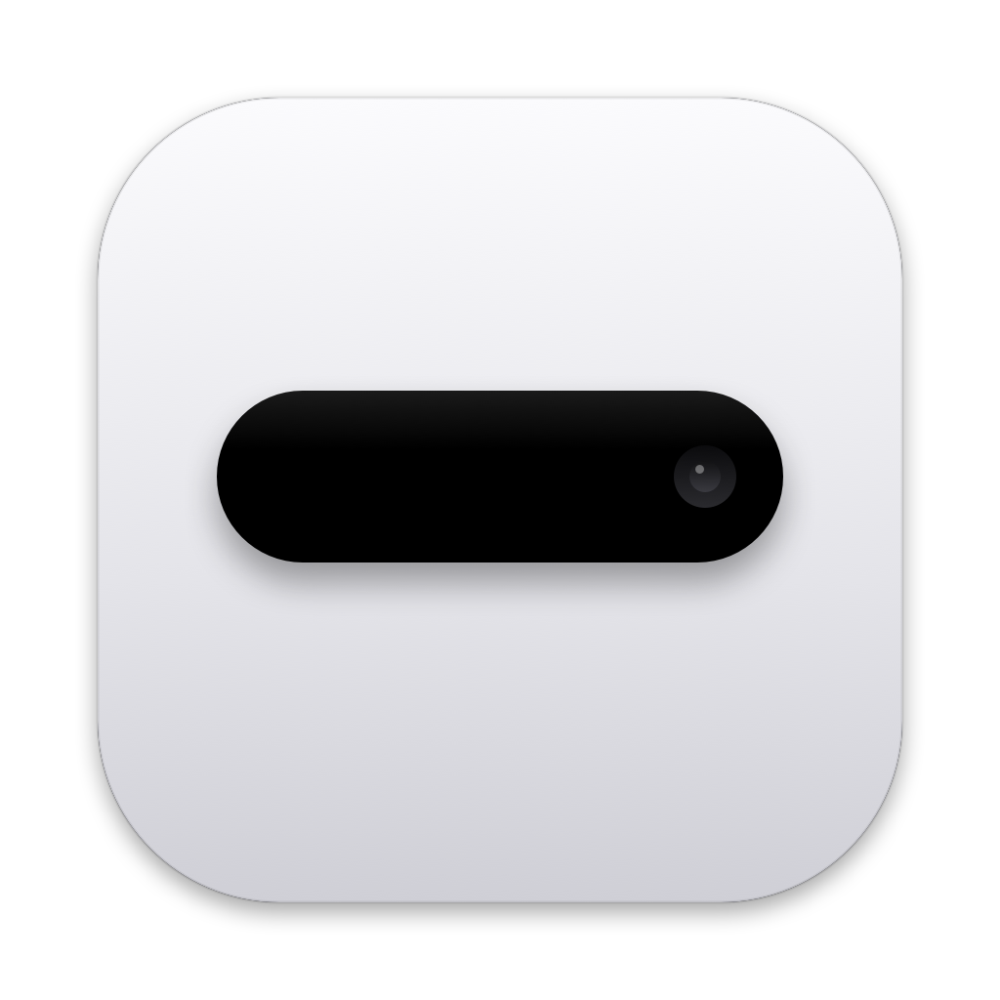
</p>

<h1 align="center">Notchly</h1>

<p align="center">
  Turns the MacBook notch into an interactive island — music, tasks, notes, files, reminders and system controls,<br>
  one hover away. Native SwiftUI, no Electron, no Xcode required.
</p>

<p align="center">
  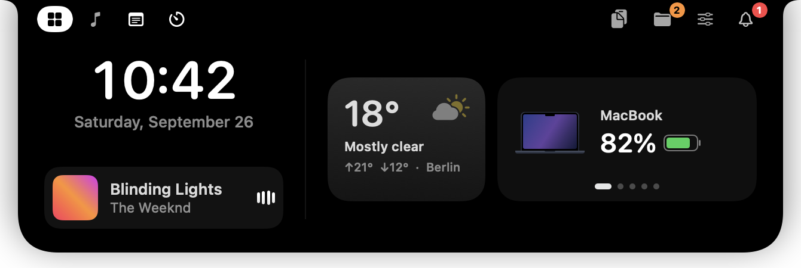
</p>

<p align="center">
  
</p>

## Features

| | |
|---|---|
| **Home** — clock, mini player, weather and a swipeable battery card: MacBook, AirPods (left / right / case), Magic Mouse, iPhone. When nothing is playing: a day summary (“4 tasks · 17:00 Gym”). | 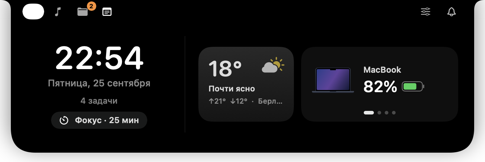 |
| **Timer tab** — *Pomodoro* (25 min work, 5 min break, a long break after every fourth round, optionally bound to a task; notifications stay quiet until the break), a regular *timer* with presets or any time down to the second (arrows or just type it), and *alarms*. Running timers live in the collapsed island as a ring and a countdown. | 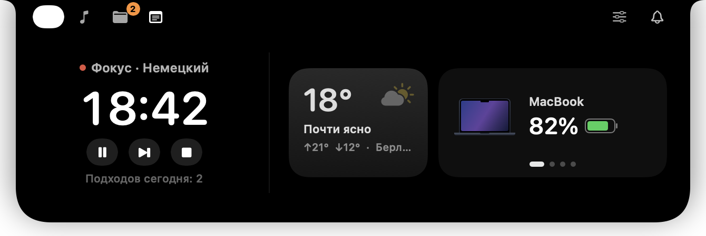<br>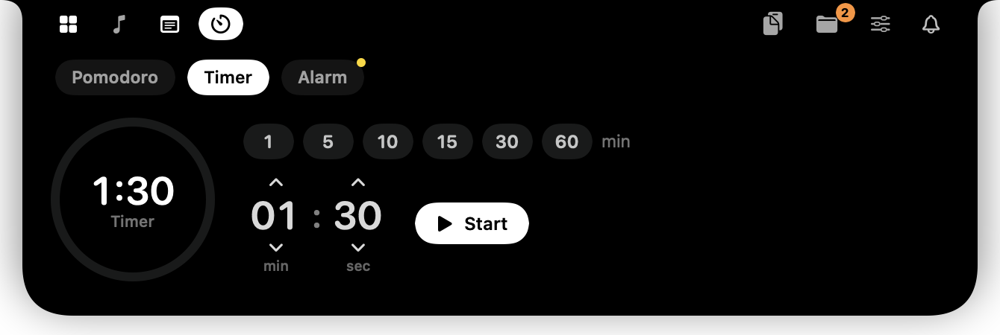<br>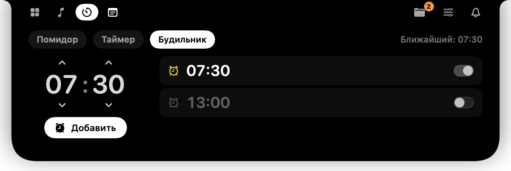<br> |
| **Tasks** — a one-week planner (Today, Tomorrow, …) with swipe between days, times, descriptions with clickable links, and a Gemini assistant that turns “gym at 5, call at 10” into tasks. | 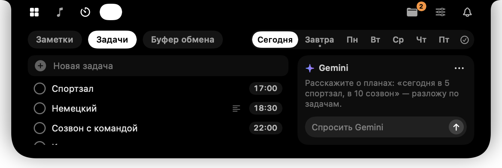 |
| **Reminders** — 10 and 5 minutes before and exactly at the start of a timed task or calendar event, a card drops out of the notch with a soft synthesized chime. *Join* opens Zoom / Meet / Teams links, *+5 min* snoozes, *Done* checks the task off. |  |
| **AirPods** — on connect, the island shows the earbuds and the case with charge rings, like on iPhone; click for the full sheet. On Home, every connected pair gets its own card (AirPods Pro, AirPods Max, …). | <br>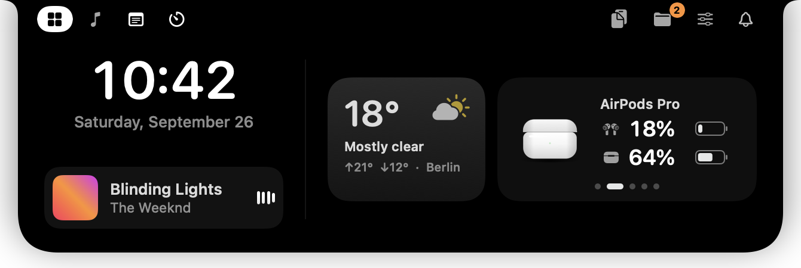 |
| **Music** — artwork with a glow sampled from the cover, scrubbing, repeat-one, quick switch between Apple Music, Spotify and YouTube Music. Live activity with an equalizer in the collapsed island. | 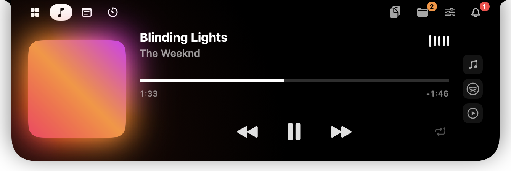 |
| **Controls** — volume, brightness and a **per-app volume mixer** built on Core Audio process taps. | 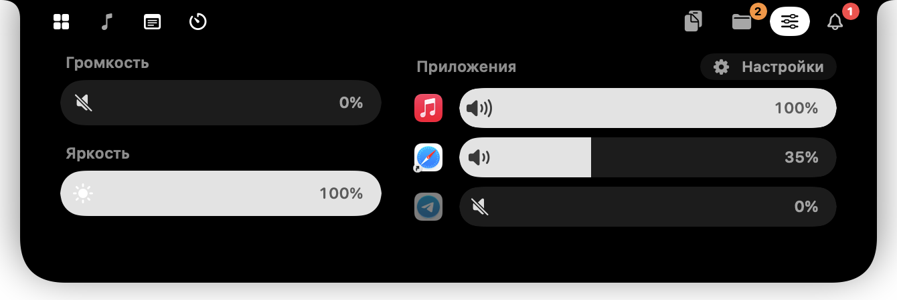 |
| **Files** — a shelf to drop files on and drag them out again (AirDrop, Reveal in Finder, Copy Path). | 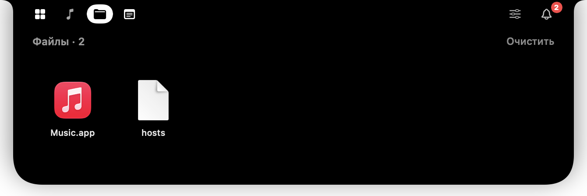 |
| **Clipboard** — history grouped by app, recent **screenshots** (click to copy, drag into any app, save a copy; kept for a few days); entries and screenshots can be given their own names, and a Touch ID–protected API key vault. | 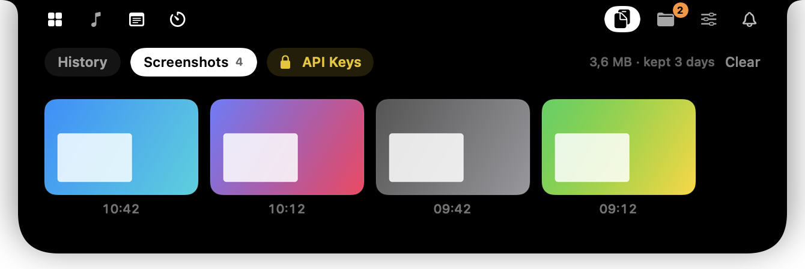<br>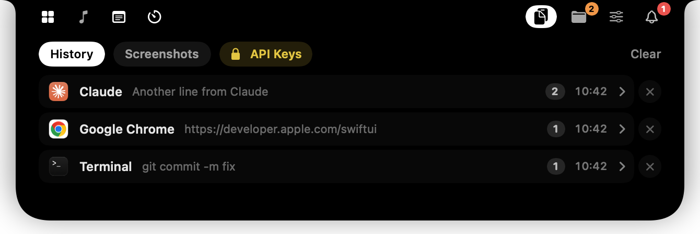 |
| **Settings** — a separate window that opens under the island, so every change is visible live: tab order and side, hidden tabs, which cards and HUDs appear, notifications, clipboard and screenshot retention, how long the island stays open. | 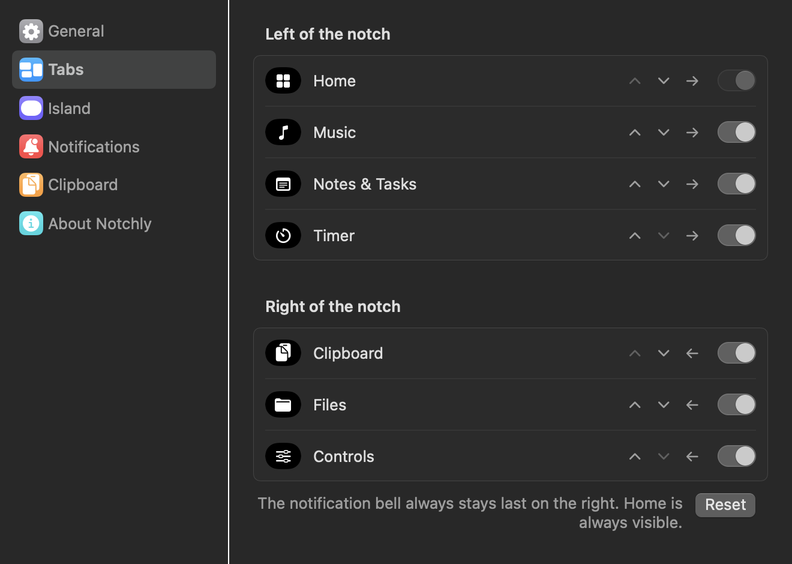 |

Also: rich-text notes, a notification center (Gmail over IMAP + app notifications), volume/brightness HUDs that replace the system ones.

## Engineering highlights

- **Now Playing on macOS 15.4+.** `MediaRemote` is closed to third-party apps, so a tiny dylib (`MediaAdapter/`) is loaded into the system `/usr/bin/perl`, which is still entitled, and streams player state as JSON lines. AppleScript is the fallback.
- **Per-app volume.** Core Audio process taps + a private aggregate device. Taps are created only for apps below 100 % and the process list is updated in place, so audio never restarts. Helper processes are folded into their parent app via `responsibility_get_pid_responsible_for_pid`.
- **Animations without layout jumps.** Island content lives on a fixed, centered canvas; only the black shape (background + mask) animates. Removed views therefore can't slide sideways, and text is never scaled or blurred.
- **System integration.** `CGEventTap` intercepts brightness/volume keys and keeps the menu bar from sliding over the island; notifications are read (read-only) from the Notification Center database with `DispatchSource` file watching; IMAP runs on `Network.framework` with TLS; calendar via EventKit.
- **No Xcode.** Swift Package + Command Line Tools. `build.sh` builds a universal `.app`, bundles the media adapter and signs it with a stable local certificate so macOS permissions survive rebuilds.
- **Headless UI checks.** `Notchly --snapshots <dir>` renders every island state to PNG — used to verify layout without a screen recording.

## Privacy

Everything stays on your Mac: no server, no analytics, no telemetry. Secrets live only in the Keychain (this device only), the API vault is behind Touch ID, data files are owner-only, the clipboard skips password-manager entries, notifications are read read-only, only web links are ever opened, and permissions are asked only when a feature needs them. Details, screenshots and a full list of network calls: **[PRIVACY.md](PRIVACY.md)**.

## Requirements

- MacBook with a notch (works on other Macs as a floating pill), macOS 14 or later; developed on Apple Silicon.
- Command Line Tools (`xcode-select --install`). Xcode is not needed.

## Build & run

```bash
./scripts/setup-signing.sh   # once: creates a local signing certificate so permissions persist
./build.sh
open build/Notchly.app
```

Regenerate the icon with `swift scripts/make-icon.swift`.

### Permissions

| Permission | Used for |
|---|---|
| Accessibility | media-key interception, keeping the menu bar hidden over the island |
| Full Disk Access | reading app notifications (Telegram, WhatsApp, …) |
| Audio Capture | per-app volume mixer |
| Calendars | meeting reminders |
| Bluetooth, Location | headphone battery, local weather |

### Self-checks

```bash
.build/debug/Notchly --snapshots /tmp/notchly   # render all states to PNG
.build/debug/Notchly --reminders-selftest       # reminder scheduling
.build/debug/Notchly --mixer-selftest           # which apps are playing audio
.build/debug/Notchly --chime                    # play the reminder sound
```

## Project structure

```
Sources/Notchly/
  App.swift, IslandModel.swift, NotchWindowController.swift   app entry, state machine, panel & mouse
  MediaController.swift, ScriptablePlayers.swift              now playing
  AppAudioMixer.swift, SystemControls.swift                   audio / brightness
  Reminders.swift, Focus.swift, ClockTimers.swift             reminders, calendar, chime, Pomodoro, timer, alarms
  GmailClient.swift, SystemNotifications.swift, GeminiAssistant.swift
  Views/                                                      SwiftUI views
MediaAdapter/                                                 dylib loaded into /usr/bin/perl
scripts/                                                      signing and icon generation
```

## Roadmap

- Ask Gemini about selected text with a global shortcut
- Spaced-repetition cards generated from a PDF dropped on the island

---

<sub>Интерфейс приложения на русском. Notchly — не продукт Apple; «Dynamic Island» — торговая марка Apple Inc.</sub>
