<p align="center">
  
</p>

<h1 align="center">Notchly</h1>

<p align="center">
  <a href="README.md">English</a> · <b>Русский</b>
</p>

<p align="center">
  Превращает вырез экрана MacBook в интерактивный остров — музыка, задачи, заметки, таймеры, напоминания,<br>
  буфер обмена, файлы и системные настройки на расстоянии одного наведения курсора. Нативный SwiftUI, без Electron и без Xcode.
</p>

<p align="center">
  
</p>

<p align="center">
  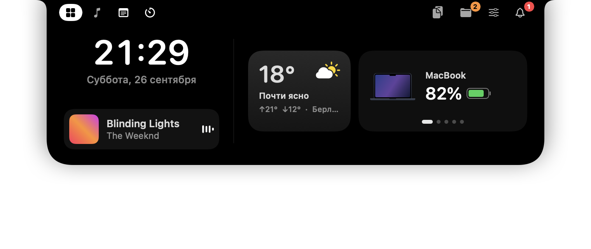
</p>

## Содержание

- [Скачать](#скачать)
- [Как это работает](#как-это-работает)
- [Возможности](#возможности) — [Главная](#главная) · [Музыка](#музыка) · [Заметки и задачи](#заметки-и-задачи) · [Таймер](#таймер-помидор-и-будильники) · [Напоминания](#напоминания) · [AirPods и заряд](#airpods-и-заряд) · [Управление](#управление) · [Файлы](#файлы) · [Буфер обмена](#буфер-обмена) · [Уведомления](#уведомления) · [Свёрнутый остров](#свёрнутый-остров) · [Настройки](#настройки)
- [Приватность](#приватность)
- [Требования](#требования) · [Сборка и запуск](#сборка-и-запуск) · [Доступы](#доступы)
- [Инженерные решения](#инженерные-решения) · [Самопроверки](#самопроверки) · [Структура проекта](#структура-проекта)

## Скачать

Скачайте `Notchly-1.0.dmg` в разделе [Releases](../../releases), откройте его и перетащите Notchly в «Программы».

Приложение подписано локальным сертификатом, а не Apple Developer ID, поэтому при первом запуске macOS сообщит, что не может проверить разработчика. Нажмите на Notchly правой кнопкой → **Открыть** → **Открыть** (или *Системные настройки → Конфиденциальность и безопасность → Всё равно открыть*). Это нужно сделать один раз.

## Как это работает

- **Наведите курсор** на вырез — остров опускается, как шторка, и показывает последнюю вкладку (или Главную). Уведите курсор — он закроется через заданную задержку; клик мимо острова закрывает его сразу.
- **Вкладки** расположены по обе стороны выреза: слева Главная, Музыка, Заметки и задачи, Таймер; справа Буфер обмена, Файлы, Управление и колокольчик уведомлений. Порядок, сторону и видимость можно настроить.
- **В свёрнутом виде** остров продолжает жить: показывает, что играет, идущие таймеры, индикатор громкости и яркости, карточки зарядки и наушников, напоминания и уведомления — и снова прячется в вырез.
- На Mac **без выреза** остров становится плавающей «пилюлей» у верхнего края экрана.
- Весь интерфейс доступен **на русском и английском** и переключается на лету, без перезапуска.

## Возможности

### Главная

Часы и дата, мини-плеер, погода и перелистываемая карточка заряда — MacBook, AirPods (левый / правый / кейс), AirPods Max, Magic Mouse, iPhone и другие Bluetooth-аксессуары. Когда музыка не играет, вместо плеера — сводка дня: «4 задачи · 22:00 Созвон с командой».

Погода берётся из Open-Meteo: текущая температура, состояние, максимум и минимум за день и город. Нажмите на карточку, чтобы разрешить точное местоположение или открыть полный прогноз.

<p align="center">
  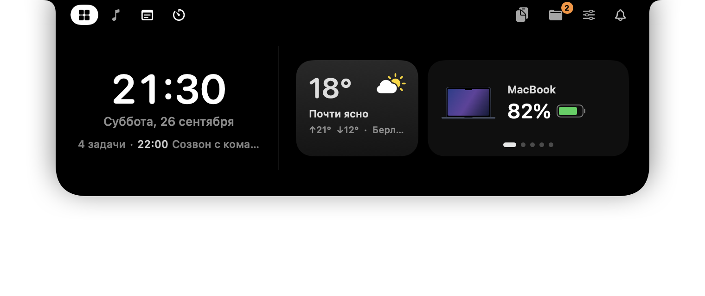
  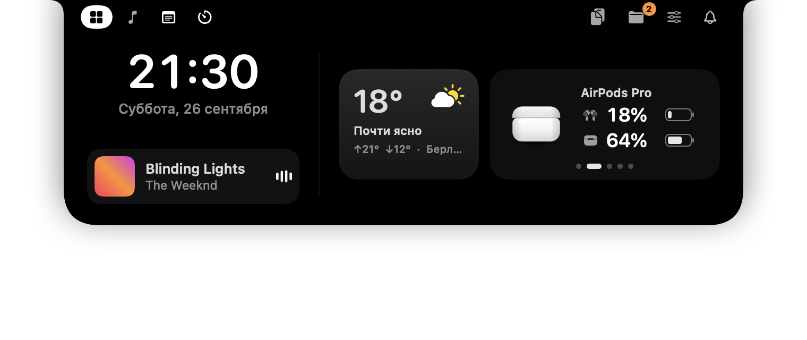
</p>

### Музыка

Крупная обложка со свечением в её цветах, название и исполнитель, перематываемая шкала, назад / пауза / вперёд и повтор трека. Быстрое переключение между **Apple Music, Spotify и YouTube Music** (в браузере); если ничего не играет, любой из них запускается одним нажатием. Работает с любым приложением, которое сообщает macOS о воспроизведении, — в том числе на macOS 15.4+, где системный API закрыт для сторонних приложений (см. [Инженерные решения](#инженерные-решения)).

<p align="center">
  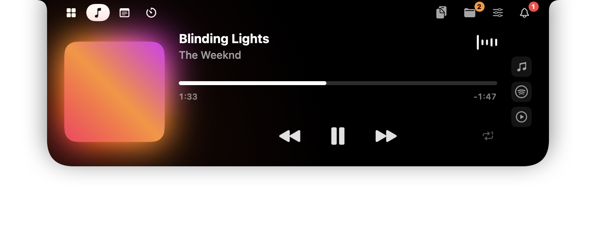
  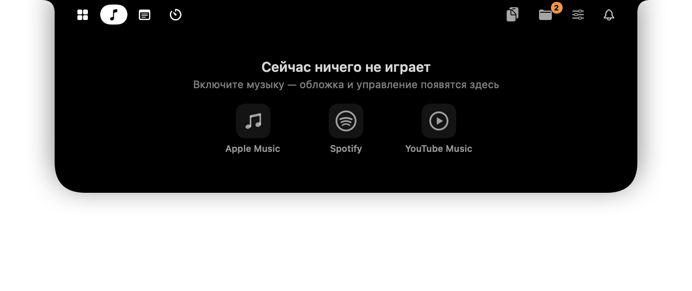
</p>

### Заметки и задачи

**Заметки** — список заметок с редактором форматированного текста: жирный, курсив, зачёркнутый, размер текста. Всё сохраняется на ходу.

**Задачи** — планер на неделю (Сегодня, Завтра и дальше по дням недели), дни листаются свайпом. У задачи может быть время и описание; ссылки из описания превращаются в кнопки. Невыполненные задачи прошлых дней сами переносятся на сегодня. С любой задачи можно запустить «Помидор», привязанный к ней.

**Помощник Gemini** — напишите планы обычными словами («зал в 5, созвон в 10»), и он превратит их в короткие задачи со временем; на вопрос ответит коротко. Отвечает на языке интерфейса; нужен собственный бесплатный API-ключ Gemini, он хранится в Связке ключей.

<p align="center">
  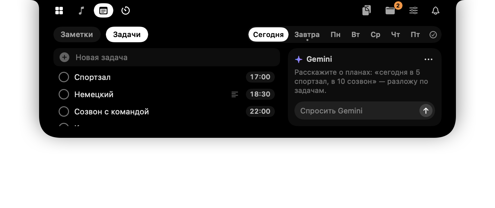
  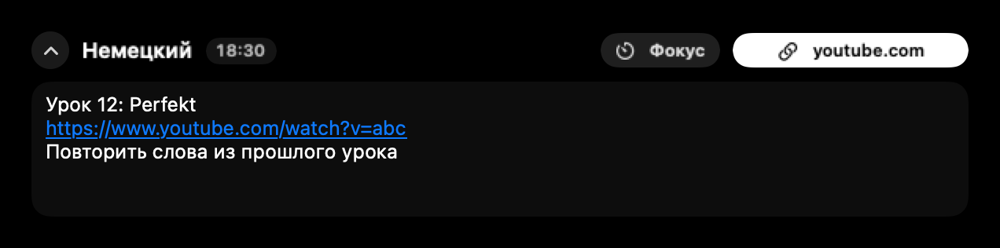
</p>

### Таймер, «Помидор» и будильники

- **«Помидор»** — 25 минут работы, 5 минут перерыва, после каждого четвёртого подхода — 15 минут; точки показывают прогресс, подходы считаются за день. Можно привязать к задаче. Пока вы работаете, уведомления копятся молча, а в перерыв приходит одна сводка.
- **Таймер** — готовые варианты (1, 5, 10, 15, 30, 60 мин) или любое время с точностью до секунды: стрелками или просто набрав цифры. Когда он сработает: *Ещё раз* или *Готово*.
- **Будильники** — список будильников с переключателями; сработавший можно *Остановить* или отложить на *+5 мин*.
- Идущий таймер живёт **в свёрнутом острове** в виде кольца прогресса и обратного отсчёта.

<p align="center">
  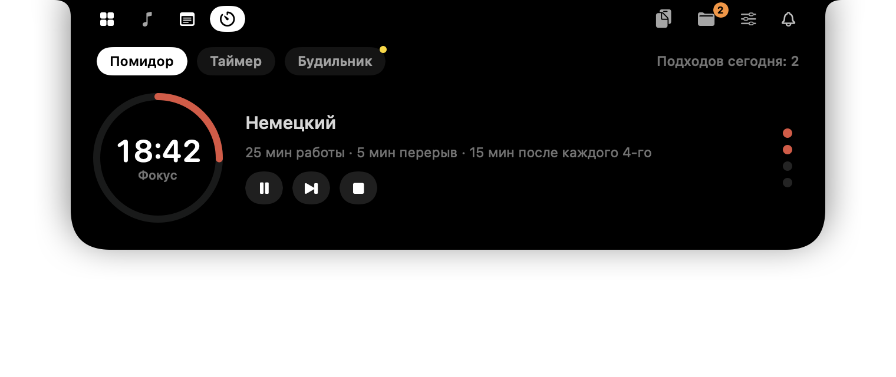
  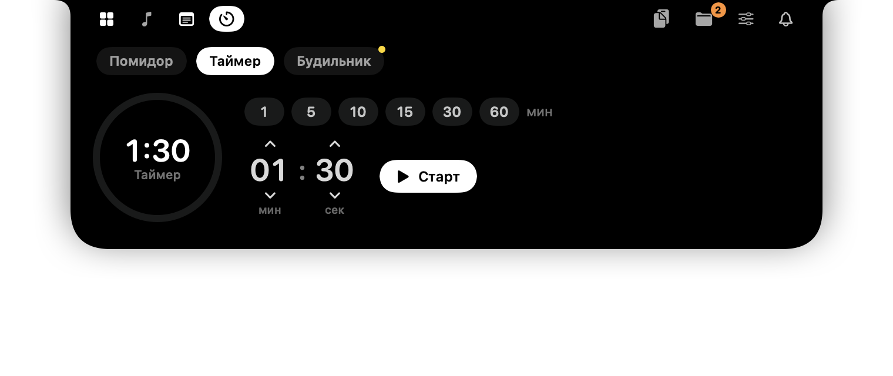
</p>
<p align="center">
  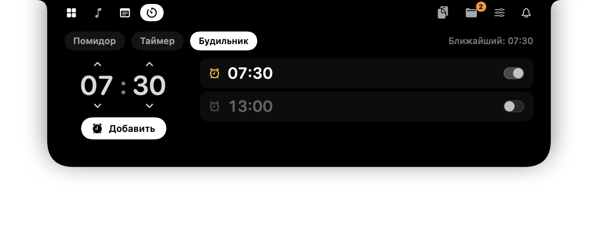
  
</p>

### Напоминания

За 10 и за 5 минут и ровно в момент начала задачи со временем или события календаря из выреза выпадает карточка с мягким синтезированным сигналом:

- **Войти** открывает ссылку Zoom, Google Meet, Microsoft Teams, FaceTime или Яндекс Телемоста из события;
- **+5 мин** откладывает напоминание;
- **Готово** отмечает задачу выполненной.

Напоминания не повторяются и не высыпаются пачкой после долгого сна Mac. Задача сразу после полуночи тоже получит напоминания накануне вечером.

<p align="center">
  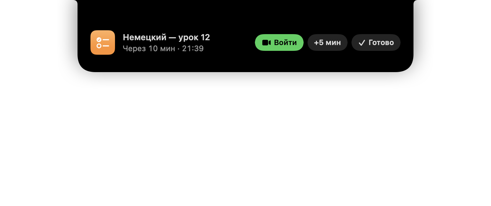
  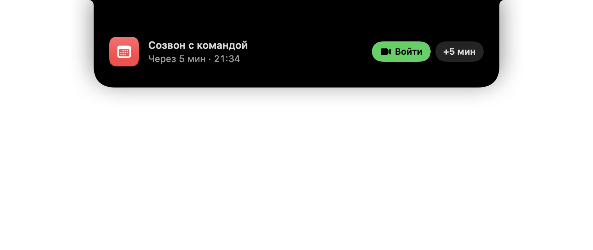
</p>

### AirPods и заряд

При подключении наушников остров показывает вкладыши и кейс с кольцами заряда, как на iPhone; по клику — подробная карточка. Поддерживаются AirPods Pro, AirPods, AirPods Max и Beats; у каждой подключённой пары своя карточка на Главной. При подключении зарядки появляется карточка с уровнем заряда MacBook.

<p align="center">
  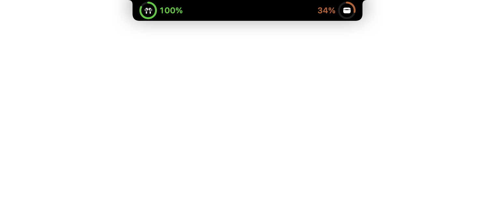
  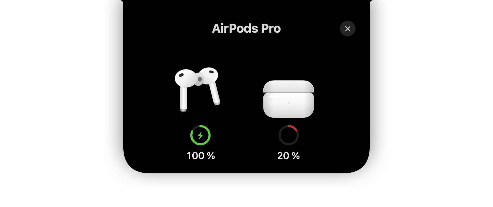
</p>
<p align="center">
  
  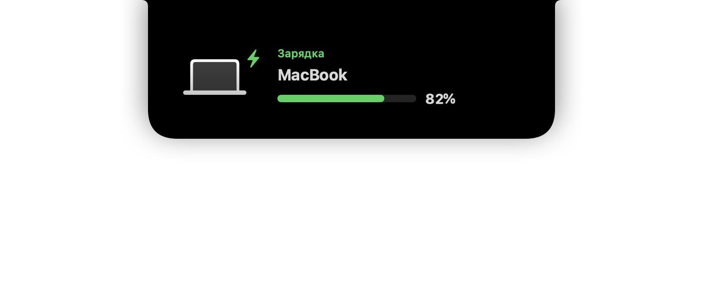
</p>

### Управление

Ползунки громкости и яркости и **микшер громкости по приложениям**: у каждого приложения, которое сейчас выводит звук, свой ползунок от 0 до 100 % — на основе Core Audio process taps. Клавиши громкости и яркости показывают индикатор Notchly в вырезе вместо системного.

<p align="center">
  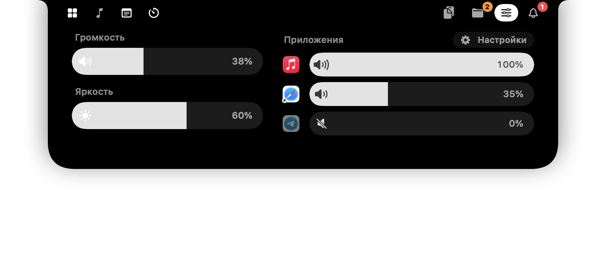
  
</p>

### Файлы

Полка для файлов: перетащите файлы на вырез, чтобы держать их под рукой, и вытаскивайте их в любое приложение. Двойной клик открывает файл; в контекстном меню — Открыть, Показать в Finder, AirDrop, Скопировать путь и Убрать.

<p align="center">
  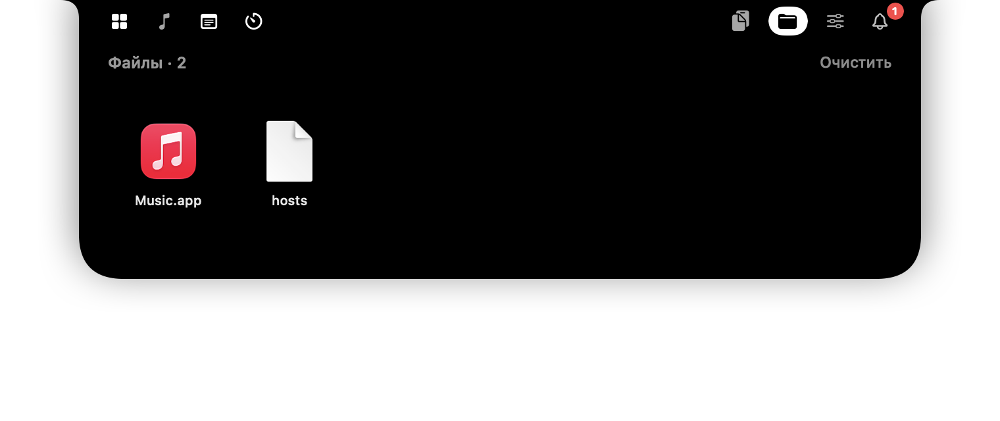
</p>

### Буфер обмена

- **История** — скопированный текст, сгруппированный по приложениям, со временем; клик копирует снова, записям можно давать свои названия, удалять по одной или очищать всё. Записи менеджеров паролей не сохраняются никогда.
- **Снимки** — снимки экрана в буфер (⌃⇧⌘4) и скопированные картинки хранятся несколько дней: клик копирует, можно перетащить в любое приложение, сохранить копию, переименовать. По желанию — и снимки с рабочего стола.
- **API-ключи** — хранилище ключей и токенов под защитой Touch ID или пароля Mac, в Связке ключей.

<p align="center">
  
  
</p>
<p align="center">
  
</p>

### Уведомления

Колокольчик собирает **уведомления приложений** (Telegram, WhatsApp, Сообщения и другие — только чтение из Центра уведомлений macOS) и **новые письма Gmail** (IMAP с паролем приложения). Новые выпадают из выреза карточками; по клику открывается приложение или письмо.

<p align="center">
  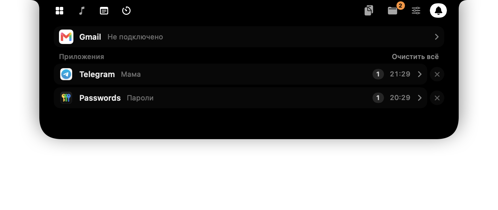
  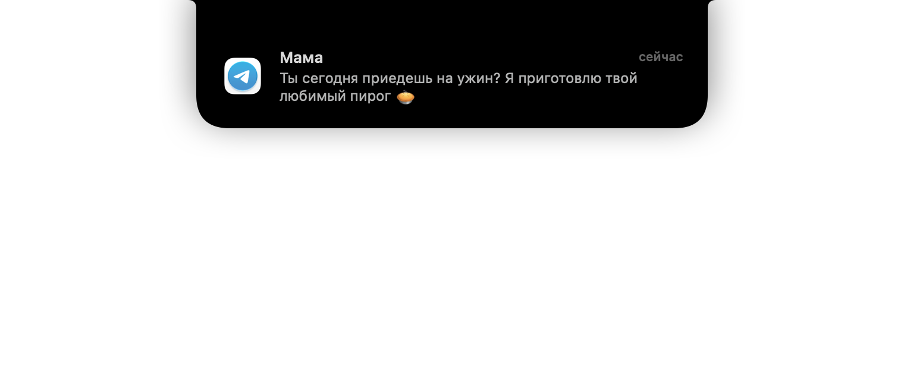
</p>

### Свёрнутый остров

Даже закрытый, остров показывает главное по бокам выреза: обложку и эквалайзер, пока играет музыка, название нового трека, индикатор громкости и яркости, «Скопировано», кольца таймера и «Помидора», заряд наушников — и карточки событий: напоминания, будильники, окончание таймера или фокус-сессии.

<p align="center">
  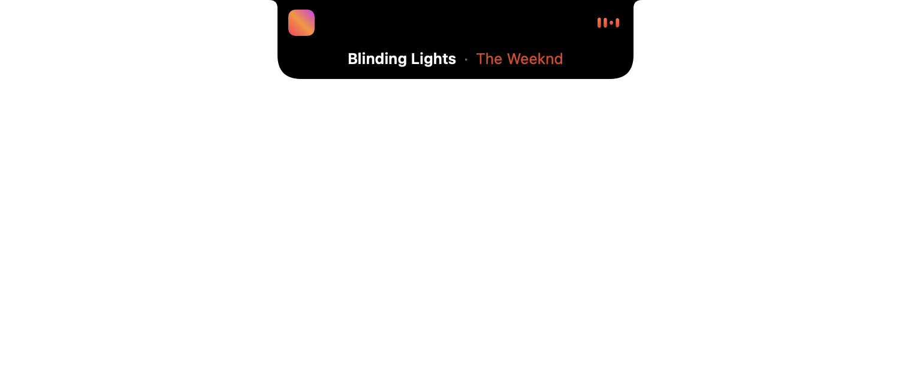
  
</p>
<p align="center">
  
  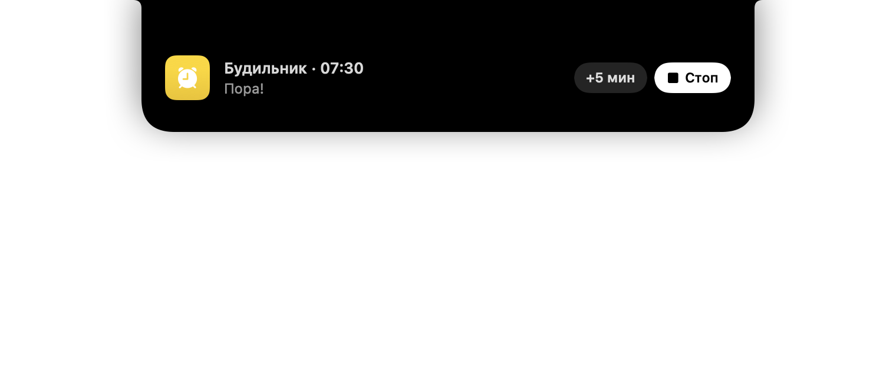
</p>

### Настройки

Отдельное окно, которое открывается прямо под островом, поэтому каждое изменение видно сразу:

- **Основные** — язык (русский / английский), запуск при входе в систему, значок в строке меню, на какой вкладке открывается остров, через сколько он закрывается после ухода курсора;
- **Вкладки** — порядок, сторона выреза (слева / справа) и видимость каждой вкладки;
- **Остров** — музыка по бокам выреза, шторка с названием трека, свой индикатор вместо системного, «Скопировано», карточки зарядки и наушников;
- **Уведомления** — уведомления приложений, Gmail, напоминания о задачах и встречах, тихий сигнал;
- **Буфер обмена** — история текста и срок хранения, снимки экрана, снимки с рабочего стола, занятое место;
- **О Notchly** — версия и выход.

<p align="center">
  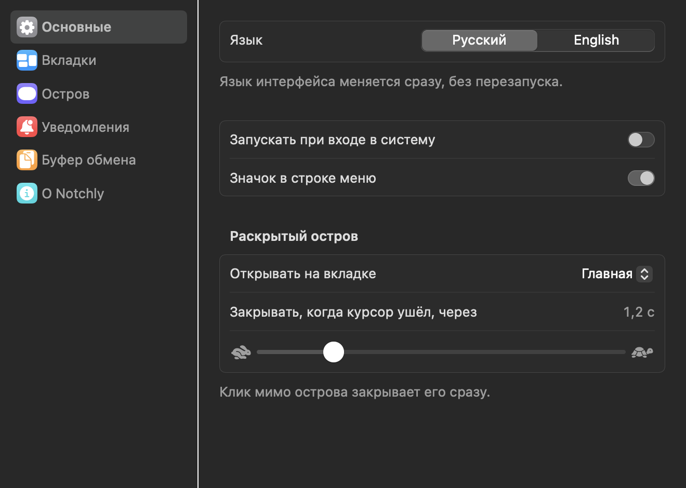
  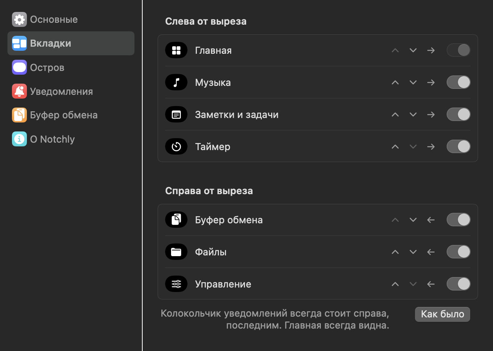
</p>

## Приватность

Всё остаётся на вашем Mac: ни сервера, ни аналитики, ни телеметрии. Секреты хранятся только в Связке ключей (только на этом устройстве), хранилище API-ключей закрыто Touch ID, файлы данных доступны только владельцу, буфер обмена пропускает записи менеджеров паролей, уведомления читаются только на чтение, открываются только веб-ссылки, а доступы запрашиваются, лишь когда функция действительно нужна. Подробности и полный список сетевых запросов: **[PRIVACY.ru.md](PRIVACY.ru.md)**.

## Требования

- MacBook с вырезом (на других Mac — плавающая «пилюля»), **macOS 14 Sonoma или новее**; разрабатывается на Apple Silicon, собирается универсальным приложением.
- Для сборки: Command Line Tools (`xcode-select --install`). Xcode не нужен.

## Сборка и запуск

```bash
git clone https://github.com/<you>/Notchly.git && cd Notchly
./scripts/setup-signing.sh   # один раз: локальный сертификат, чтобы доступы не сбрасывались после сборки
./build.sh                   # универсальный build/Notchly.app
open build/Notchly.app
```

| Скрипт | Что делает |
|---|---|
| `./build.sh` | собирает универсальный `build/Notchly.app`, кладёт внутрь медиа-адаптер, подписывает |
| `./scripts/make-dmg.sh` | собирает `build/Notchly-<версия>.dmg` для релиза |
| `./scripts/update-screenshots.sh` | перерисовывает скриншоты README на обоих языках |
| `swift scripts/make-icon.swift` | заново генерирует иконку |
| `python3 scripts/check-l10n.py` | проверяет, что у каждой строки интерфейса есть английский перевод |

### Доступы

Все доступы необязательны и запрашиваются при первом использовании функции; без них Notchly просто скрывает эту функцию.

| Доступ | Зачем |
|---|---|
| Универсальный доступ | перехват клавиш громкости и яркости, чтобы строка меню не наезжала на остров |
| Полный доступ к диску | чтение уведомлений приложений |
| Запись аудио | микшер громкости по приложениям (звук только масштабируется, не записывается) |
| Календари | напоминания о встречах |
| Bluetooth | заряд наушников |
| Геопозиция | местная погода (иначе — примерно, по IP) |
| Папка «Рабочий стол» | сохранение снимков с рабочего стола (только если включить) |

## Инженерные решения

- **Now Playing на macOS 15.4+.** `MediaRemote` закрыт для сторонних приложений, поэтому крошечная dylib (`MediaAdapter/`) загружается в системный `/usr/bin/perl`, у которого доступ ещё есть, и передаёт состояние плеера строками JSON. Запасной вариант — AppleScript.
- **Громкость по приложениям.** Core Audio process taps + приватное агрегатное устройство. Taps создаются только для приложений ниже 100 %, а список процессов обновляется на месте, поэтому звук никогда не перезапускается. Вспомогательные процессы сводятся к родительскому приложению через `responsibility_get_pid_responsible_for_pid`; вместо опроса — слушатели Core Audio.
- **Анимации без скачков вёрстки.** Содержимое острова лежит на фиксированном центрированном холсте, анимируется только чёрная форма (фон + маска), поэтому ничего не уезжает вбок, а текст не масштабируется и не размывается. Бесконечные анимации (эквалайзер, блик, пульс) идут на Core Animation, так что простаивающий остров почти не тратит CPU.
- **Интеграция с системой.** `CGEventTap` перехватывает клавиши яркости и громкости и не даёт строке меню наезжать на остров; уведомления читаются только на чтение из базы Центра уведомлений с отслеживанием файла через `DispatchSource`; IMAP работает на `Network.framework` с TLS через одно долгоживущее соединение; календарь — EventKit; заряд AirPods — IOBluetooth.
- **Без Xcode.** Swift Package + Command Line Tools. `build.sh` собирает универсальный `.app`, кладёт внутрь медиа-адаптер и подписывает постоянным локальным сертификатом, чтобы доступы macOS сохранялись между сборками.
- **Проверка интерфейса без экрана.** `Notchly --snapshots <папка>` рендерит каждое состояние острова в PNG — все скриншоты этого README сделаны так, на обоих языках.

### Самопроверки

```bash
swift build
.build/debug/Notchly --snapshots /tmp/notchly --lang ru   # все состояния в PNG
.build/debug/Notchly --gif docs/notchly.gif --lang en      # анимация для README, по кадрам
.build/debug/Notchly --reminders-selftest                  # расписание напоминаний, включая переход через полночь
.build/debug/Notchly --mixer-selftest                      # какие приложения сейчас выводят звук
.build/debug/Notchly --batteries-selftest                  # подключённые устройства и их заряд
.build/debug/Notchly --bench                               # нагрузка на CPU в типичных состояниях
.build/debug/Notchly --chime                               # проиграть сигнал напоминания
python3 scripts/check-l10n.py                              # переводы полные
```

## Структура проекта

```
Sources/Notchly/
  App.swift                      точка входа, значок в строке меню, флаги самопроверок
  IslandModel.swift              состояния острова и тайминги анимаций
  NotchWindowController.swift    панель над вырезом, наведение и клики
  MediaController.swift          что играет (медиа-адаптер + AppleScript)
  ScriptablePlayers.swift        управление Apple Music / Spotify
  AppAudioMixer.swift            громкость по приложениям на Core Audio process taps
  SystemControls.swift           громкость, яркость, индикатор
  MediaKeyInterceptor.swift      CGEventTap для медиаклавиш
  MenuBarGuard.swift             не даёт строке меню закрыть остров
  Reminders.swift                напоминания, календарь, мягкий сигнал
  Focus.swift, ClockTimers.swift «Помидор», таймер, будильники
  Stores.swift                   задачи, заметки, полка файлов; миграция данных
  ClipboardMonitor.swift         история буфера обмена
  ScreenshotStore.swift          снимки экрана и скопированные картинки
  KeyVault.swift, Keychain.swift хранилище API-ключей под Touch ID
  DeviceBatteryMonitor.swift     заряд MacBook, AirPods и аксессуаров
  WeatherService.swift           погода Open-Meteo и местоположение
  GmailClient.swift              IMAP на Network.framework
  SystemNotifications.swift      чтение базы Центра уведомлений
  GeminiAssistant.swift          планы → задачи через Gemini
  Settings.swift                 настройки пользователя
  Localization.swift, English.swift  поиск L(...) и английская таблица
  Snapshots.swift, ReadmeGIF.swift, Bench.swift  рендер без экрана и замеры
  Views/                         SwiftUI-представления вкладок, карточек и окна настроек
MediaAdapter/                    dylib для /usr/bin/perl ради Now Playing
Resources/                       Info.plist, иконка, локализованное имя приложения
scripts/                         подпись, иконка, .dmg, скриншоты, проверка переводов
docs/                            иконка, анимация и скриншоты (en / ru)
```

## Планы

- Спросить Gemini о выделенном тексте глобальным сочетанием клавиш
- Карточки для интервального повторения из PDF, брошенного на остров

## Лицензия

[MIT](LICENSE)

---

<sub>Notchly не является продуктом Apple. «Dynamic Island», AirPods, Apple Music и FaceTime — товарные знаки Apple Inc.; другие названия продуктов принадлежат их владельцам.</sub>
